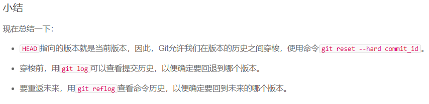
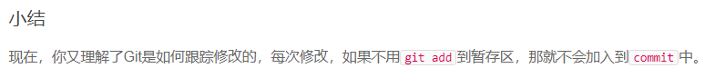
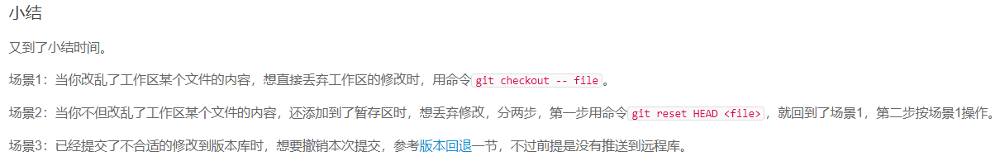
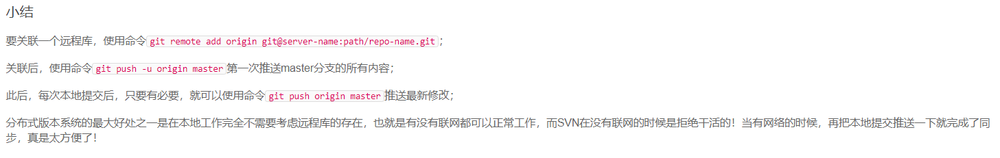
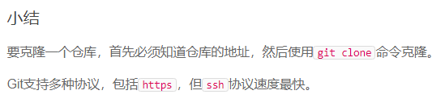
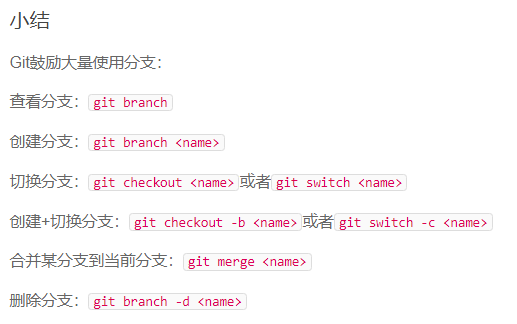
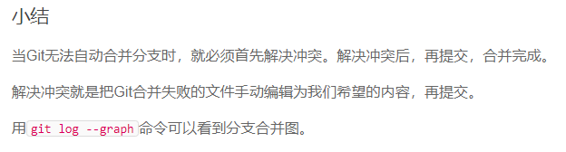

# Git   开淦
### Git简介
#### 安装Git
**Linux安装Git**
sudo apt-get install git
其他安装忽略！
**安装后设置名字和Email**
``` bash
$ git config --global user.name "Your Name"
$ git config --global user.email "email@example.com"
```
#### 创建版本库
``` bash
# 首先，选择一个合适的地方，创建一个空目录：
$ mkdir learngit
$ cd learngit
$ pwd
/Users/michael/learngit
# 第二步，通过git init命令把这个目录变成Git可以管理的仓库：
$ git init
Initialized empty Git repository in /Users/michael/learngit/.git/
```
**把文件添加到版本库**
``` bash
# 第一步，用命令git add告诉Git，把文件添加到仓库：
$ git add readme.txt
# 第二步，用命令git commit告诉Git，把文件提交到仓库：
# -m后面输入的是本次提交的说明
$ git commit -m "wrote a readme file"
[master (root-commit) eaadf4e] wrote a readme file
 1 file changed, 2 insertions(+)
 create mode 100644 readme.txt
```
### 时光穿梭机
#### 版本退回
**显示从最近到最远的提交日志  HEAD 表示当前版本**
```bash
$ git log
commit 48f79c1e80ba280261a53b9129d8919906024081 (HEAD -> master)
Author: lixingjie2589 <2111920436@qq.com>
Date:   Thu Oct 22 15:33:16 2020 +0800

    two
    
commit 19f9fe948eb8843bb590ff73dee7d908055ae92d
Author: lixingjie2589 <2111920436@qq.com>
Date:   Thu Oct 22 15:32:31 2020 +0800

    one

commit 96eeddb9863db5add26c241a15288010c0de0383
Author: lixingjie2589 <2111920436@qq.com>
Date:   Thu Oct 22 15:16:48 2020 +0800

    xxx
```
**回退到上一个版本**
```bash
# 上一个版本就是HEAD^，上上一个版本就是HEAD^^，当然往上100个版本写100个^比较容易数不过来，所以写成HEAD~100
$ git reset --hard HEAD^   或   git reset --hard commit_id
HEAD is now at 19f9fe9 one
```
**记录你的每一次命令**

```bash
$ git reflog
19f9fe9 (HEAD -> master) HEAD@{0}: reset: moving to HEAD^
48f79c1 HEAD@{1}: commit: two
19f9fe9 (HEAD -> master) HEAD@{2}: commit: one
96eeddb HEAD@{3}: commit (initial): xxx
```

#### 工作区和暂存区
**查看状态**
```bash
$ git status
On branch master
Changes not staged for commit:
  (use "git add <file>..." to update what will be committed)
  (use "git checkout -- <file>..." to discard changes in working directory)

	modified:   readme.txt

Untracked files:
  (use "git add <file>..." to include in what will be committed)

	readme2.txt

no changes added to commit (use "git add" and/or "git commit -a")
```
#### 管理修改
**查看工作区和版本库里面最新版本的区别**
```bash
$ git diff HEAD -- readme.txt 
diff --git a/readme.txt b/readme.txt
index 76d770f..a9c5755 100644
--- a/readme.txt
+++ b/readme.txt
@@ -1,4 +1,4 @@
 Git is a distributed version control system.
 Git is free software distributed under the GPL.
 Git has a mutable index called stage.
-Git tracks changes.
+Git tracks changes of files.
```


#### 撤销修改
**丢弃工作区的修改**

```bash
$ git checkout -- readme.txt
# 命令git checkout -- readme.txt意思就是，把readme.txt文件在工作区的修改全部撤销，这里有两种情况：
# 一种是readme.txt自修改后还没有被放到暂存区，现在，撤销修改就回到和版本库一模一样的状态；
# 一种是readme.txt已经添加到暂存区后，又作了修改，现在，撤销修改就回到添加到暂存区后的状态。
# 总之，就是让这个文件回到最近一次git commit或git add时的状态。
```
**把暂存区的修改撤销掉**
```bash
$ git reset HEAD readme.txt
Unstaged changes after reset:
M	readme.txt
```

#### 删除文件
**从版本库中删除文件**
```bash
$ git rm test.txt
rm 'test.txt'

$ git commit -m "remove test.txt"
[master d46f35e] remove test.txt
 1 file changed, 1 deletion(-)
 delete mode 100644 test.txt
```
**删错了**
```bash
$ git checkout -- test.txt
```
### 远程仓库
#### 添加远程库
先在GitHub创建一个仓库，在到本地仓库下运行命令：
```bahs
$ git remote add origin git@github.com:你的GitHub名/learngit.git
```
**推送**
```bash
$ git push -u origin master
Counting objects: 20, done.
Delta compression using up to 4 threads.
Compressing objects: 100% (15/15), done.
Writing objects: 100% (20/20), 1.64 KiB | 560.00 KiB/s, done.
Total 20 (delta 5), reused 0 (delta 0)
remote: Resolving deltas: 100% (5/5), done.
To github.com:michaelliao/learngit.git
 * [new branch]      master -> master
Branch 'master' set up to track remote branch 'master' from 'origin'.
```
可能有SSH警告！！！


#### 从远程库克隆
先在GitHub创建一个仓库，然后在本地克隆：
```bahs
$ git clone git@github.com:michaelliao/gitskills.git
Cloning into 'gitskills'...
remote: Counting objects: 3, done.
remote: Total 3 (delta 0), reused 0 (delta 0), pack-reused 3
Receiving objects: 100% (3/3), done.
```

### 分支管理
#### 创建与合并分支
**首先，我们创建dev分支，然后切换到dev分支：**
```bash
$ git checkout -b dev
Switched to a new branch 'dev'
```
**git checkout命令加上-b参数表示创建并切换，相当于以下两条命令：**
```bash
$ git branch dev
$ git checkout dev
Switched to branch 'dev'
```
**然后，用git branch命令查看当前分支：有星的表示当前分支 **
```bash
$ git branch
* dev
  master
```
**git merge命令用于合并指定分支到当前分支**
```bash
$ git merge dev
Updating d46f35e..b17d20e
Fast-forward
 readme.txt | 1 +
 1 file changed, 1 insertion(+)
```
**更科学地切换分支**
```bash
# 创建并切换到新的dev分支，可以使用：
$ git switch -c dev
# 直接切换到已有的master分支，可以使用：
$ git switch master
```

#### 解决冲突
**合并**

```bash
$ git merge feature1
Auto-merging readme.txt
CONFLICT (content): Merge conflict in readme.txt
Automatic merge failed; fix conflicts and then commit the result.
```
Git告诉我们，readme.txt文件存在冲突，必须手动解决冲突后再提交。git status也可以告诉我们冲突的文件：
```bash
$ git status
On branch master
Your branch is ahead of 'origin/master' by 2 commits.
  (use "git push" to publish your local commits)

You have unmerged paths.
  (fix conflicts and run "git commit")
  (use "git merge --abort" to abort the merge)

Unmerged paths:
  (use "git add <file>..." to mark resolution)

	both modified:   readme.txt

no changes added to commit (use "git add" and/or "git commit -a")
```
我们可以直接查看readme.txt的内容：
```bahs
Git is a distributed version control system.
Git is free software distributed under the GPL.
Git has a mutable index called stage.
Git tracks changes of files.
<<<<<<< HEAD
Creating a new branch is quick & simple.
=======
Creating a new branch is quick AND simple.
>>>>>>> feature1
```
Git用<<<<<<<，=======，>>>>>>>标记出不同分支的内容
手动修改文件的冲突再提交就完成了！


#### 分支管理策略

#### Bug分支

#### Feature分支

#### 多人协作

#### Rebase