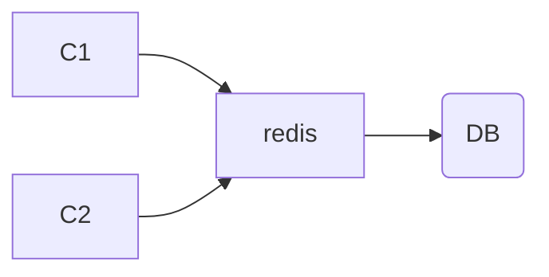

### 缓存
#### 一、为什么使用缓存
1.高性能
2.高可用

#### 二、什么是缓存穿透？缓存击穿？缓存雪崩？怎么解决？
**1、缓存穿透：缓存中查不到，数据库中也查不到**
解决：

- 对参数进行合法性校验；
- 将数据库中没有查到的数据也写到缓存。这时候需要防止redis被无用的key占满内存，这一类缓存的有效期设置短一点；
- 引入布隆过滤器，在访问缓存之前判断数据是否存在。要注意布隆过滤器存在一定误判率，并且只能加数据不能减数据；

**2、缓存击穿：缓存中没有，数据库中用。一般是出现在缓存数据初始化及Key过期的情况。他的问题在与高并发下过多的请求瞬间写到DB上，给DB造成很大的压力；**

解决：

- 设置热点缓存永不过期，这时要注意在value当中包含一个逻辑上的过期时间，然后另起一个线程，定期重建这些缓存。
- 加载DB的时候，要防止并发。

**3、缓存雪崩:缓存大面积过期，导致请求都被转发到DB。**

解决方案：

- 把缓存的时效时间分散开。例如，在原有的统一失效时间基础上，增加一个随机值。

#### 三、如何保证Redis与数据库的数据一致？

当我们对数据进行修改的时候，到底是先册缓存，还是先写数据库?

1、如果先删缓存，再写数据库:在高并发场景下，当第一个线程删除了缓存，还没有来得及写数据库，第二个线程来读取数据，会发现缓存中的数据为空，那就会去读数据库中的数据(旧值，脏数据)，读完之后，把读到的结果写入缓存(此时，第一个线程已经将新的值写到缓存里面了)，这样缓存中的值就会被覆盖为修改前的脏数据。

解决方案：

- 先操作缓存，但是不删除缓存。将缓存修改为一个特殊值(-999)。客户端读缓存时，发现是默认值，就休眠一小会，再去查一次Redis。-》特殊值对业务有侵入。休眠时间，可能会多次重复。休眠时间，可能会多次重复，对性能有影响。
- 延时双删。先删除缓存，然后再写数据库,休眠一小会，再次删除缓存。-》如果数据写操作很频繁，同样还是会有脏数据的问题。

总结:在这种方式下，通常要求写操作不会太频繁。

2、先写数据库，再删缓存:如果数据库写完了之后，缓存删除失败，数据就会不一致。

解决方案：

- 给缓存设置一个过期时间问题:过期时间内，缓存数据不会更新。
- 引入MQ，保证原子操作。

总结:始终只能保证一定时间内的最终—致性。

